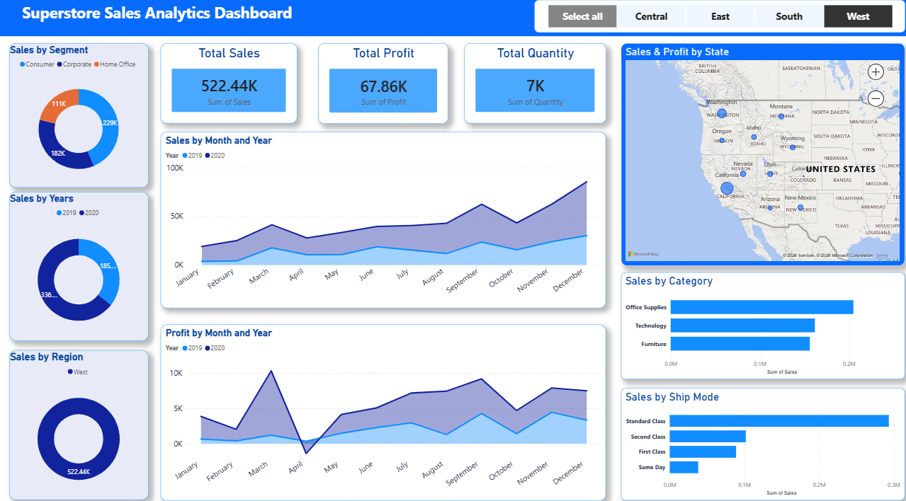
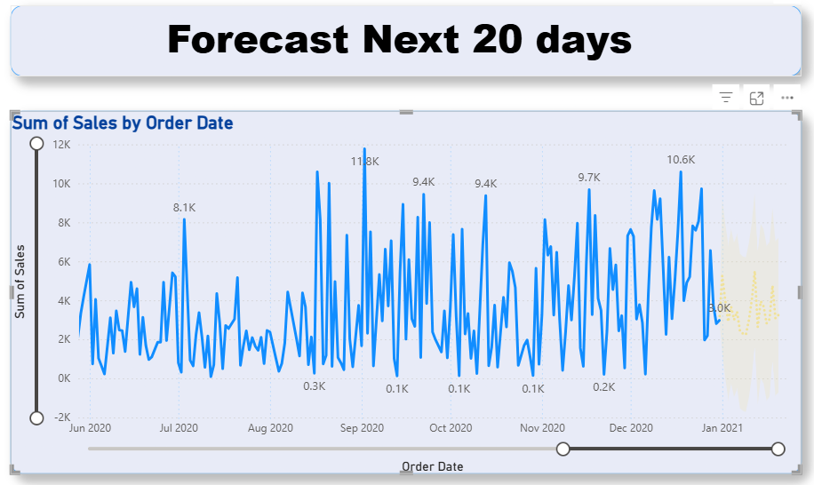

# Superstore Sales Analytics Dashboard

## Overview
This project is an end-to-end Sales Analytics Dashboard built using Power BI.

The raw sales dataset was cleaned and transformed using Power Query before creating interactive dashboards and forecasting future sales trends.

## Tools Used
- Power BI
- Power Query
- DAX
- Data Cleaning
- Data Visualization
- Forecasting

## Key Metrics
- Total Sales: 522.44K
- Total Profit: 67.86K
- Total Quantity Sold: 7K

## Dashboard Features
- Sales by Segment
- Sales by Category
- Sales by Region
- State-wise Sales Analysis
- Monthly Sales Trends
- Profit Analysis
- Ship Mode Analysis
- Interactive Filters
- 20-Day Sales Forecasting

## Project Workflow
1. Collected the sales dataset.
2. Cleaned and transformed the data using Power Query.
3. Created data model and relationships.
4. Built KPIs and visualizations.
5. Designed an interactive dashboard.
6. Generated a 20-day sales forecast.

## Dashboard Preview

### Main Dashboard

### Sales Forecast

## Business Insights
- West region generated the highest sales.
- Office Supplies contributed the highest revenue.
- Standard Class was the most used shipping mode.
- Sales showed an increasing trend towards the end of the year.
- Forecasting indicates continued sales activity in upcoming days.

## Author
Taranjeet Singh
